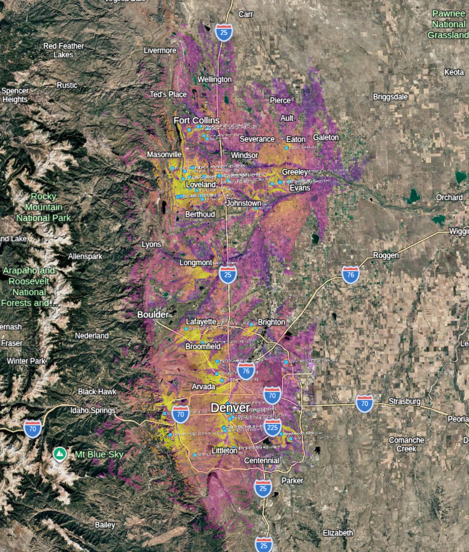

# Meshtile

C++ HTTP tile server that computes RF signal coverage for Meshtastic mesh network nodes using the [NTIA ITM (Longley-Rice)](https://github.com/NTIA/itm) propagation model and SRTM elevation data, then serves blended signal-strength tiles as 256x256 PNGs.



## Build

Requires: libcurl, zlib, a C++17 compiler.

```bash
mkdir build && cd build
cmake ..
make -j$(nproc)
```

CMake auto-downloads all third-party dependencies via FetchContent (NTIA ITM, cpp-httplib, nlohmann/json, lodepng).

## Usage

```bash
./meshtile [options]
```

### Server Options

| Flag | Default | Description |
|------|---------|-------------|
| `--host` | `0.0.0.0` | Bind address |
| `--port` | `8080` | Listen port |
| `--region` | `den` | [MeshMapper](https://meshmapper.net) region prefix (see below) |
| `--nodes` | meshmapper API | Override node source with a URL or local JSON file |
| `--noise-data` | meshmapper API | Override noise floor data with a URL or local file |
| `--max-range` | `30` | Max propagation range per node (km) |

### MeshMapper Regions

Node and noise floor data are fetched from [MeshMapper](https://meshmapper.net) regional instances. Each instance uses a short prefix as its subdomain (e.g. `den.meshmapper.net`, `oma.meshmapper.net`). Use `--region` to select which instance to pull from:

```bash
./meshtile --region den    # Denver (default)
./meshtile --region oma    # Omaha
./meshtile --region pnw    # Pacific Northwest
./meshtile --region yyc    # Calgary
```

The full list of available regions is at [meshmapper.net](https://meshmapper.net). The `--nodes` and `--noise-data` flags override the region-based URLs if you need a custom source.

### ITM Propagation Parameters

| Flag | Default | Description |
|------|---------|-------------|
| `--climate` | `5` | ITM climate code (1=Equatorial, 2=Continental Subtropical, 3=Maritime Tropical, 4=Desert, 5=Continental Temperate, 6=Maritime Temperate Over Land, 7=Maritime Temperate Over Sea) |
| `--refractivity` | `301.0` | Surface refractivity (N-units) |
| `--ground-dielectric` | `15.0` | Ground dielectric constant |
| `--ground-conductivity` | `0.005` | Ground conductivity (S/m) |
| `--clutter-height` | `0.0` | Ground clutter height in meters (trees, buildings) |
| `--time-pct` | `50.0` | ITM time variability (0-100%) |
| `--location-pct` | `50.0` | ITM location variability (0-100%) |
| `--situation-pct` | `50.0` | ITM situation variability (0-100%) |

### Display Options

| Flag | Default | Description |
|------|---------|-------------|
| `--colormap` | `red_yellow_green` | Tile colormap: `red_yellow_green`, `plasma`, `viridis`, `turbo`, `inferno` |

### Example

```bash
./meshtile --port 9090 --climate 6 --clutter-height 2 --colormap plasma
```

All effective parameters are logged at startup, whether set explicitly or left at defaults.

## Endpoints

| Endpoint | Description |
|----------|-------------|
| `GET /tiles/{z}/{x}/{y}.png` | Signal coverage + node markers (256x256 RGBA PNG) |
| `GET /signal/{z}/{x}/{y}.png` | Signal coverage only |
| `GET /nodes/{z}/{x}/{y}.png` | Node markers only |
| `GET /overlay.kml` | KML network link for Google Earth |
| `GET /health` | Health check |

## Google Earth

In Google Earth: hamburger menu > Map Style > Add Tile Overlay > `http://host:port/tiles/{z}/{x}/{y}.png`

## Caching

- Per-node signal grids are cached to disk at `~/.cache/meshtile/<region>/grids/`
- Rendered tile PNGs are cached to disk + memory at `~/.cache/meshtile/<region>/tiles/`
- HGT elevation tiles are cached at `~/.cache/mesh3d/hgt/` (shared with mesh3d)
- Changing any ITM or RF parameter automatically invalidates cached grids on next run

## How It Works

1. Fetches the node list from the meshmapper API (or local JSON)
2. For each node, loads SRTM HGT elevation data and runs ITM point-to-point propagation for every grid cell within `max_range` km
3. Signal grids are cached per-node; when a new node appears, only its grid is computed and only overlapping tiles are invalidated
4. At render time, overlapping grids are blended (strongest signal wins) and mapped through the selected colormap
5. Tiles are served as standard XYZ slippy map PNGs with CORS headers

## Dependencies

| Library | Purpose |
|---------|---------|
| [NTIA ITM](https://github.com/NTIA/itm) | Longley-Rice propagation model |
| [cpp-httplib](https://github.com/yhirose/cpp-httplib) | HTTP server |
| [nlohmann/json](https://github.com/nlohmann/json) | JSON parsing |
| [lodepng](https://github.com/lvandeve/lodepng) | PNG encoding |
| libcurl | HTTP client |
| zlib | Gzip decompression |

## License

MIT. See [LICENSE](LICENSE) for details.

Third-party dependency licenses are listed in [THIRD_PARTY_LICENSES](THIRD_PARTY_LICENSES).
